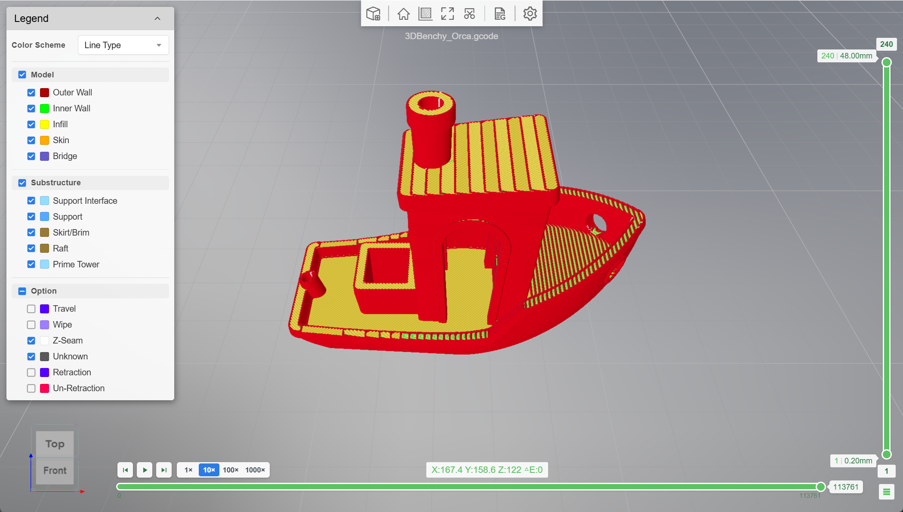
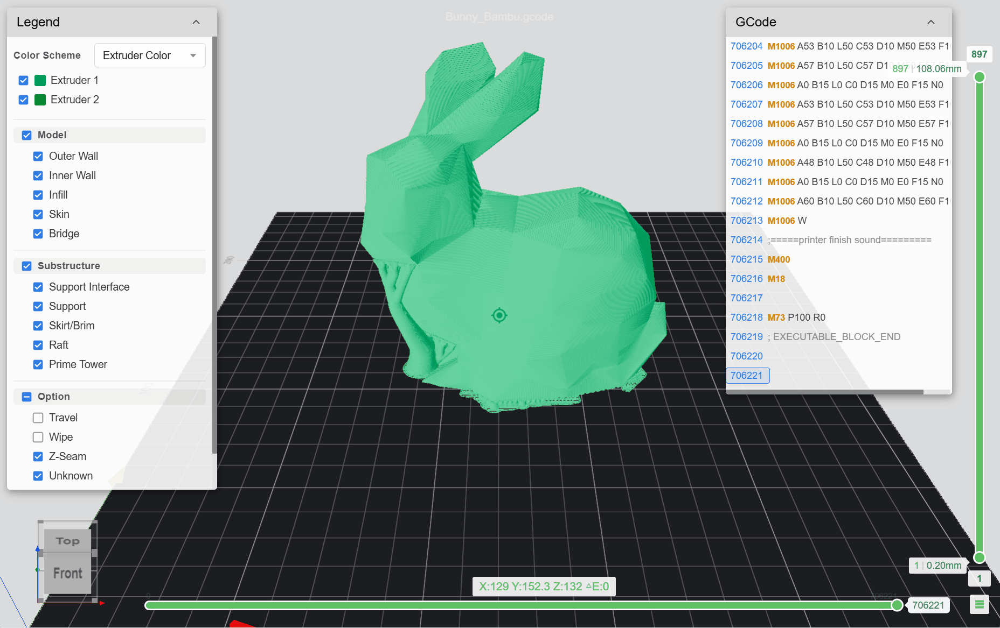
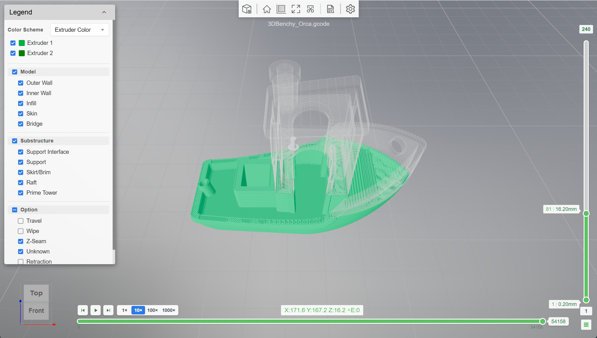
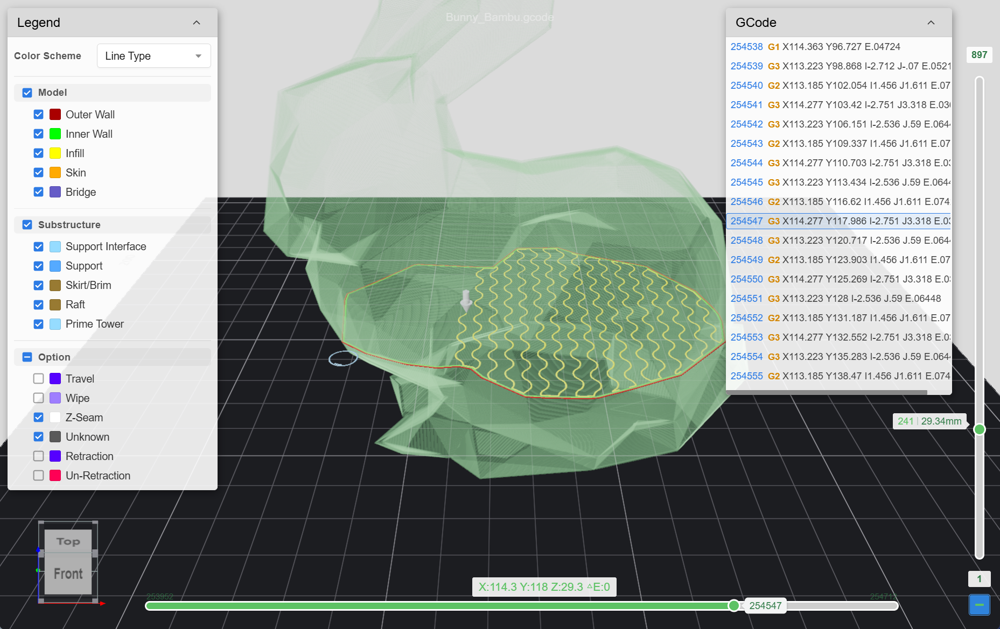
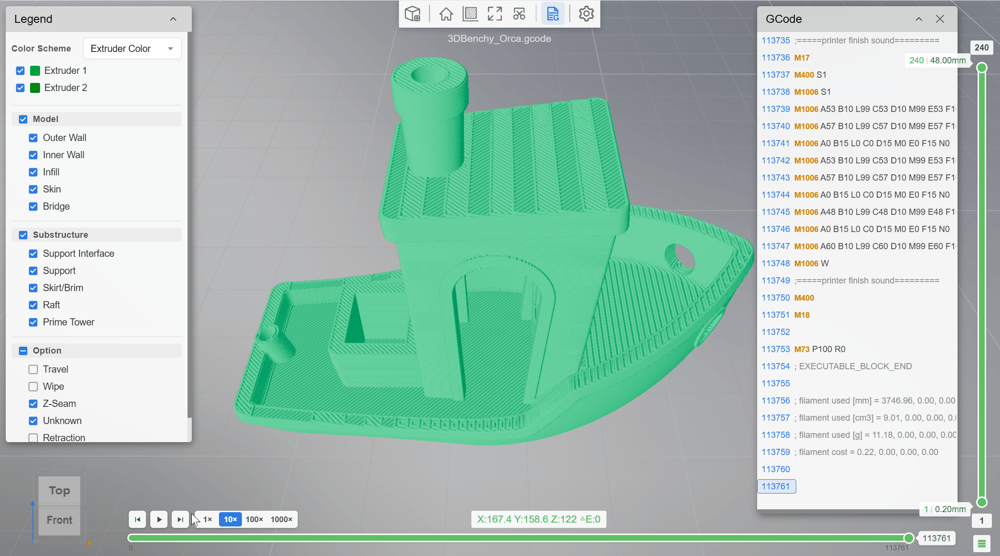

# Thingraph GCode Viewer

**GCode Viewer** is a browser-based **3D GCode visualizer** for inspecting slicer toolpaths before you print.

Open **.gcode** from Bambu Studio, OrcaSlicer, PrusaSlicer, Cura, and similar workflows — no desktop install required. Files are parsed and rendered **locally in your browser** (WebGL); nothing is uploaded to Thingraph for viewing.

The same site also includes a **CAD Viewer** page powered by `Viewer3d` for common 3D mesh formats (useful for checking STL/OBJ and other models alongside GCode).

Live app: [https://gcode.thingraph.site/](https://gcode.thingraph.site/)





---

## Why preview GCode?

Slicer output is what your printer actually runs. A quick 3D preview helps you:

- Spot bad travels, missing layers, or unexpected feature types before wasting filament
- Scrub layers and step through moves to see *how* a part will be printed
- Cross-check the toolpath against the GCode text when something looks wrong
- Share or open sample files without installing another desktop app

Works on modern desktop browsers (Chrome, Firefox, Edge, Safari, and similar).

---

## Supported File Formats

### GCode Viewer (3D print toolpaths)

| Format | Description |
|--------|-------------|
| **gcode** | Common slicer export (Bambu Studio, OrcaSlicer, PrusaSlicer, Cura, and others) |

### CAD Viewer (`Viewer3d`)

| Format | Description |
|--------|-------------|
| **glTF / GLB** | GL Transmission Format (JSON or binary) |
| **OBJ** | Wavefront Object |
| **FBX** | Autodesk Filmbox |
| **STL** | Stereolithography (often used in 3D printing) |
| **PLY** | Polygon File Format |
| **DAE** | Collada |
| **3DM** | Rhino (via plugin loader) |
| **STP / STEP** | ISO 10303 STEP exchange |
| **IGS / IGES** | Initial Graphics Exchange Specification |

---

## Features

### GCode / 3D print preview

- **3D toolpath visualization** — orbit, pan, and zoom the print path on a build plate (WebGL via `@gcode-viewer/core`)
- **Layer scrubbing** — focus on a height range with the layer bar (inspect one layer band or a stack); inactive layers can show as a light ghost shell
- **Step playback** — scrub moves on the active layer, or play the print sequence with speed controls
- **Legend / color schemes** — color by line type (perimeter, infill, travel, …), speed, and related modes; toggle categories when slicer metadata is present
- **GCode text panel** — source lines synced to the current move for analysis
- **Client-side only** — parse and render on your device; optional public URL load (CORS permitting)
- **Examples** — try sample GCode (and CAD models) without uploading your own files

**Layer range** — drag the vertical bar to keep a band of layers solid while the rest of the print stays as a ghost outline:



**Step scrubbing** — use the bottom bar to walk individual moves on the active layer; the nozzle marker and GCode panel stay in sync:



**Play animation** — play / pause the print sequence from the steps bar, with speed multipliers and skip-to-start / skip-to-end:



### CAD / 3D models

- Orbit, pan, and zoom on glTF, OBJ, STL, and other mesh formats
- Toolbar: measure, section, screenshot, tree view, settings
- Skybox, plate, and ground shadow for orientation

---

## Powered by @gcode-viewer

This site is built on **`@gcode-viewer/core`**, **`@gcode-viewer/plugins`**, and **`@gcode-viewer/ui`** — a WebGL viewer stack on Three.js.

### Install the SDK

```bash
pnpm add @gcode-viewer/core @gcode-viewer/plugins
# or
npm install @gcode-viewer/core @gcode-viewer/plugins
```

### Quick Start — GCodeViewer

```typescript
import { GCodeViewer } from '@gcode-viewer/core'
import { GCodeLegendPlugin, GCodeLayerBarPlugin } from '@gcode-viewer/plugins'

const viewer = new GCodeViewer({ containerId: 'myCanvas' })
new GCodeLayerBarPlugin(viewer)
new GCodeLegendPlugin(viewer)
await viewer.loadModel({ modelId: 'print', src: 'path/to/model.gcode' })
// Replace a file: viewer.unload() then loadModel again
```

### Quick Start — Viewer3d

```typescript
import { Viewer3d } from '@gcode-viewer/core'

const viewer = new Viewer3d({ containerId: 'myCanvas' })
await viewer.loadModel({ modelId: 'model', src: 'path/to/model.glb' })
```

### Related packages

| Package | Description |
|---------|-------------|
| `@gcode-viewer/core` | Engine — `GCodeViewer`, `Viewer3d`, loaders |
| `@gcode-viewer/plugins` | Legend, layer/steps bars, toolbar, measure, section, etc. |
| `@gcode-viewer/ui` | Shared panels and widgets |

---

## Site pages

- [Home](https://gcode.thingraph.site/home)
- [GCode Viewer](https://gcode.thingraph.site/gcode-viewer) — upload local GCode
- [CAD Viewer](https://gcode.thingraph.site/cad-viewer) — upload local 3D models
- [Examples](https://gcode.thingraph.site/examples) — GCode and CAD samples
- [FAQ](https://gcode.thingraph.site/faq/)
- [Support](https://gcode.thingraph.site/google/cad-viewer-support)
- [Privacy](https://gcode.thingraph.site/google/cad-viewer-privacy) · [Terms](https://gcode.thingraph.site/google/cad-viewer-terms)

---

## Privacy & data

- Local preview processes files **in your browser** — GCode / model bytes are not uploaded to Thingraph servers for viewing
- Optional URL load fetches from the remote host directly (CORS must allow it)
- See the [Privacy Policy](https://gcode.thingraph.site/google/cad-viewer-privacy) for details

---

## Contact

- Email: thingraph@outlook.com

---

*Thingraph GCode Viewer is not affiliated with any slicer vendor. Not affiliated with the classic [gCodeViewer](https://gcode.ws/) project.*
